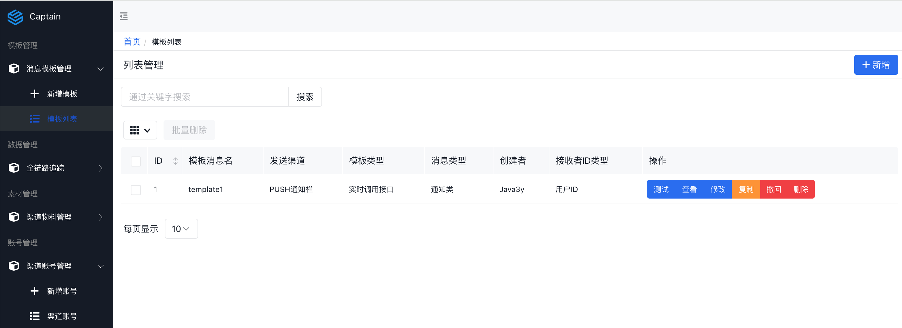

# 简介
- Captain是一个消息推送平台

# 部署
- springboot启动，最小依赖mysql和redis

# 流程
- 整体流程：sendService发送消息 -> ProcessController执行责任链 -> PipelineConfig定义责任链 -> BusinessProcess.process()具体执行
- 发送消息入口 SendService
- 对于每个消息，根据context.code=send/recall 决定执行消息发送/撤回责任链 ProcessController
- 责任链定义在配置类PipelineConfig，目前包括2个流程：send和recall, 其中send包括preCheck、assembly、postCheck和sendMQ
- 每个责任链节点都实现了 BusinessProcess.process()
